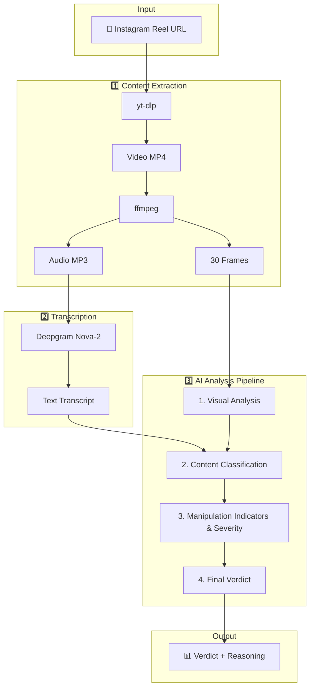
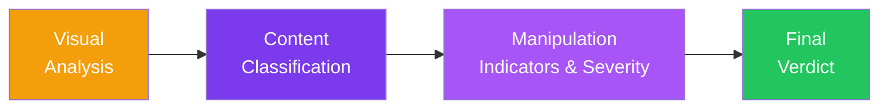

# Manipulation Detection in Influencer Marketing

**Project Lead:** Dr. Huan Chen

---

## 🎯 Project Overview

An AI-powered system that analyzes Instagram Reels to detect psychological manipulation tactics in influencer marketing content.

---

## 🔄 System Workflow



---

## 🛠️ Technology Stack

| Component | Technology | Purpose |
|-----------|------------|---------|
| **Frontend** | Next.js 14 | React-based web application |
| **Video Download** | yt-dlp | Extract video from Instagram URLs |
| **Media Processing** | ffmpeg | Audio extraction + frame capture |
| **Transcription** | Deepgram Nova-2 | Speech-to-text conversion |
| **Text Analysis** | Cerebras GPT-OSS-120B | Fast text-based manipulation analysis |
| **Image Analysis** | Gemma 3 27B | Multimodal visual content analysis |
| **Styling** | Vanilla CSS | Custom dark theme UI |

---

## 🧠 4-Step AI Analysis Pipeline



### Step Details

| Step | Purpose | Key Questions |
|------|---------|---------------|
| **1. Visual Analysis** | Analyze visual context & intent | Commercial intent? Product placement? |
| **2. Content Classification** | Determine if commercial or non-commercial | Is this promoting a product/service? |
| **3. Manipulation Indicators & Severity** | Identify specific tactics & assess harm | Deceptive claims? Missing disclosures? Harm potential? |
| **4. Final Verdict** | Generate conclusive assessment | MANIPULATIVE (Graded) / NOT MANIPULATIVE |


---

## 🎭 Manipulation Categories

| Category | Examples |
|----------|----------|
| **Deceptive Claims** | Exaggerated benefits, fake results, miracle claims |
| **Hidden Commercial Intent** | Missing #ad, buried disclosures, stealth marketing |
| **Psychological Pressure** | False scarcity, FOMO, artificial urgency |
| **Emotional Exploitation** | Targeting insecurities, guilt-tripping, fear tactics |
| **Misinformation** | False health/financial claims, pseudoscience |
| **Visual Deception** | Heavy filtering, misleading before/after, staged shots |

---

## ⚖️ Verdict Classification

```
┌─────────────────────────────────────────────────────────────┐
│                         VERDICT                              │
├─────────────────────────────────────────────────────────────┤
│  NOT MANIPULATIVE     │ Non-commercial OR properly disclosed│
│  POTENTIALLY MANIP.   │ Minor issues, ambiguous intent      │
│  MANIPULATIVE - MILD  │ Disclosure issues, mild pressure    │
│  MANIPULATIVE - MOD.  │ Clear promo, missing disclosure     │
│  MANIPULATIVE - SEVERE│ Deliberate deception, harm potential│
├─────────────────────────────────────────────────────────────┤
│  Confidence: HIGH / MEDIUM / LOW                            │
│  Categories: [list of detected manipulation types]          │
│  Reasoning: [evidence-based explanation]                    │
│  Recommendations: [viewer advice]                           │
└─────────────────────────────────────────────────────────────┘
```

---

## 🔬 Research Foundation

Based on academic research in:
- **Dark Patterns** — FOMO, urgency bias, false scarcity
- **FTC Disclosure Guidelines** — Clear & conspicuous requirements  
- **Consumer Psychology** — Parasocial relationships, vulnerability targeting
- **Deceptive Advertising** — Misleading claims, hidden sponsorships

---

## 📁 Project Structure

```
prototype/
├── src/app/
│   ├── page.tsx           # Main UI component
│   ├── globals.css        # Styling
│   └── api/
│       ├── extract/       # Video/audio extraction
│       ├── transcribe/    # Speech-to-text
│       └── analyze/       # AI analysis pipeline
├── .env.local             # API keys
└── FLOW.md                # This documentation
```

---

## 🚀 Running the Prototype

```bash
# Install dependencies
npm install

# Set environment variables in .env.local
DEEPGRAM_API_KEY=your_key
GEMINI_API_KEY=your_key

# Run development server
npm run dev

# Open http://localhost:3000
```
